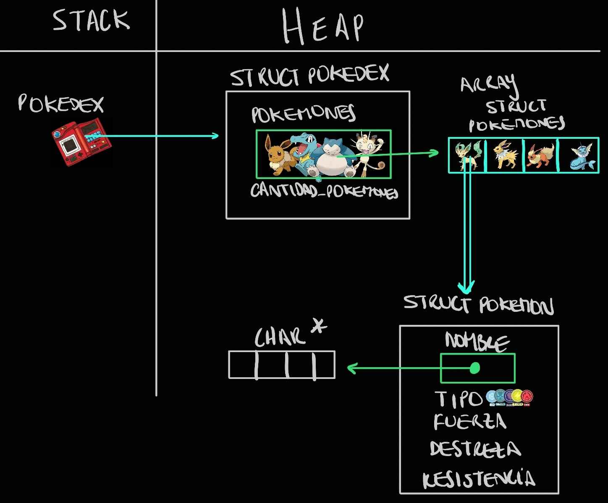
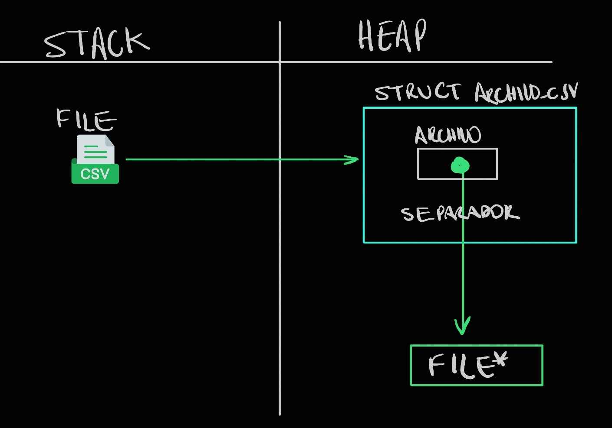
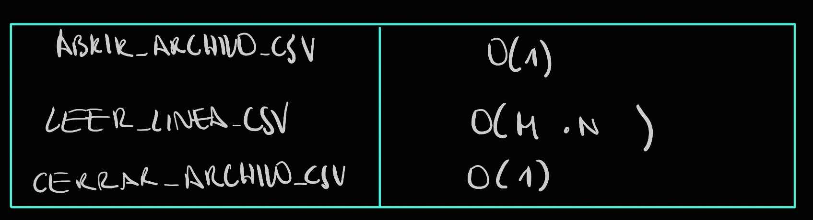

<div align="right">

</div>

# TP1

## Alumno: Conrado Garcia Palau - 111775- conardogp04@gmail.com

- Para compilar:

```bash
gcc -g -o tp1 tp1.c src/csv.c src/pokedex.c -I./src
```

- Para ejecutar:

```bash
./tp1
```

- Para ejecutar con valgrind:
```bash
valgrind --leak-check=full --track-origins=yes --show-reachable=yes --error-exitcode=2 --show-leak-kinds=all --trace-children=yes ./tp1 archivo.csv

```

---

##  Funcionamiento


- El trabajo practico se enfoca en la creación y manejo de una estructura que administra una pokedex, almacenando información sobre diferentes pokemones. Se estructura en distintas fases,primero, lectura de datos desde un archivo CSV, almacenamiento en una estructura dinamica de la pokedex, y la capacidad de ordenar y buscar los pokemoens registrados.


#### leer_linea_csv
- El archivo CSV es procesado de acuerdo a las columnas y el separador definido. Por cada línea leída, se invocan funciones específicas para procesar las columnas, validarlas, y convertirlas en un registro que luego será agregado a la Pokédex.


#### Creación de la Pokédex
- Cuando se llama a la función pokedex_crear, se asigna memoria dinamica tanto para el struct pokedex como para el array donde se almacenaran los pokemones. Si hay algún problema al asignar memoria, la función se asegura de liberar la memoria ya asignada para evitar memory leaks.


#### agregar_pokemon
 - se copia el nombre del pokemon a memoria nueva para evitar problemas de referencias compartidas, asegurando que cada Pokémon tenga su propia cadena de nombre. Después de agregar un nuevo pokemon, la pokedex se ordena 
alfabéticamente.

 
#### ordenar_pokedex
- se usa bubble_sort para ordenar los pokemones por nombre, en caso de tener el mismo nombre, se fija en el tipo, si tienen mismo tipo, se fija la fuerza,destreza,resistencia. Primero verifica si los nombres son validos antes de comparar.


#### destruir_pokedex
- se usa para liberar toda la memoria de los nonbres y el array de pokemones antes de liberar la pokedex en si.

---

## Respuestas a las preguntas teóricas

## TEORICA DIAGRAMAS
<div align="center">

</div>


<div align="center">

</div>


## TEORICA COMPLEJIDAD

**Complejidad de strcutc pokedex*pokedex_crear():**
O(1) para el struct pokedex y O(MAX_POKEMONES) para el array de pokemones.


**Complejidad pokedex_agregar_pokemon(struct pokedex *pokedex, struct pokemon pokemon)***
Ordena la pokedex despues de la insercion: O(n²) por el bubble sort, copia el nombre: O(m), donde m es el largo del nombre del pokemon, por eso es O(n2+m)

**Complejidad pokedex_cantidad_pokemones(struct pokedex *pokedex)*** Se trata de O(1) ya que solo accede a *cantidad_pokemones*

**Complejidad de const struct pokemon *pokedex_buscar_pokemon(struct pokedex *pokedex, const char *nombre)*****
Es O(n*m), N es la cantidad de pokemones, y M el largo del nombre

**Complejidad size_t pokedex_iterar_pokemones(struct pokedex *pokedex, bool (*funcion)(struct pokemon *, void *), void *ctx)*******
O(n), donde N es la cantidad de pokemones

**Complejidad de pokedex_destruir(struct pokedex *pokedex)***
O(n*m) n es la cantidad de pokemones y m es la longitud promedio de los nombres, se libera el nombre de cada pokemon (O(m) por cada uno.


<div align="center">

</div>

**abrir_archivo_csv**
usa malloc para asignar memoria,fopen depende del sistema de archivos y generalmente se considera O(1). Asi que es O(1)


 **leer_lineacsv** llama a verificar_linea, donde m es la longitud de la línea y n es el tamaño promedio de una columna: O(m*n)


****Cerrar_archivo_csv**** con fclose y liberar la memoria con free son operaciones de tiempo constante: O(1).

